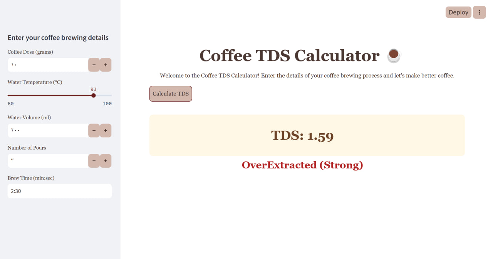
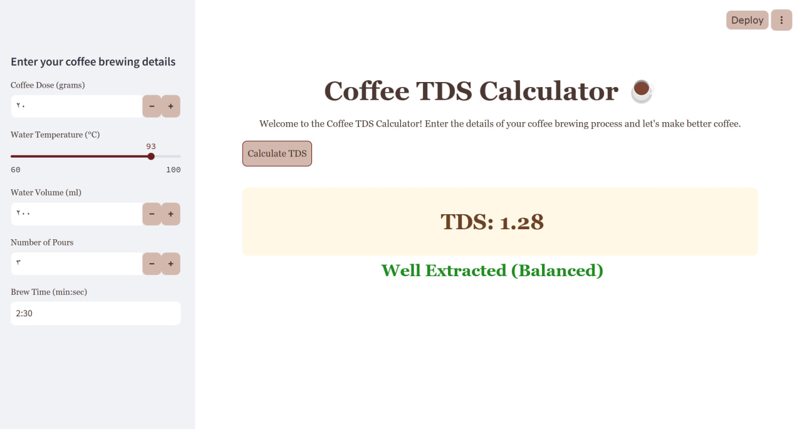
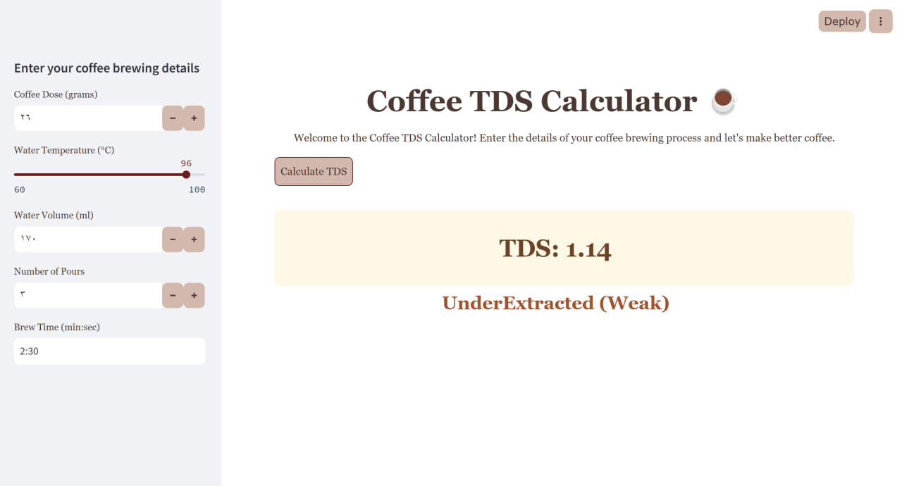

# Make Better Coffee ☕️

Welcome to the **Make Better Coffee** app! This application allows coffee lovers to input their brewing parameters (coffee dose, water temperature, volume, number of pours, and brew time) to determine if their coffee will be **strong**, **balanced**, or **weak** based on these factors. Whether you're a coffee enthusiast or a beginner, this app will guide you in making the perfect cup.

## Features

* **Input Parameters**: Enter details such as:
    * Coffee dose (in grams)
    * Water temperature (in °C)
    * Water volume (in mL)
    * Number of pours
    * Brew time (in minutes, automatically converted to seconds)

* **Coffee Strength Evaluation**: Based on the entered parameters, the app will calculate the strength of your coffee:
    * **Strong**: Bold, rich coffee.
      
    * **Balanced**: Well-rounded flavor.
      
    * **Weak**: Light coffee that may need adjustment.
      

* **Visual Appeal**: The app provides an intuitive interface with coffee-related images and smooth interactions.

